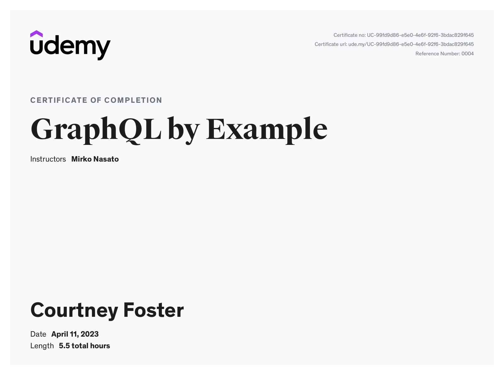

# GraphQL By Example - [Udemy](https://www.udemy.com/) Course

Utilizing GraphQL by writing full-stack JavaScript applications with Node.js, Express, Apollo Server, React, Apollo Client.

   

# Certificate of Completion

